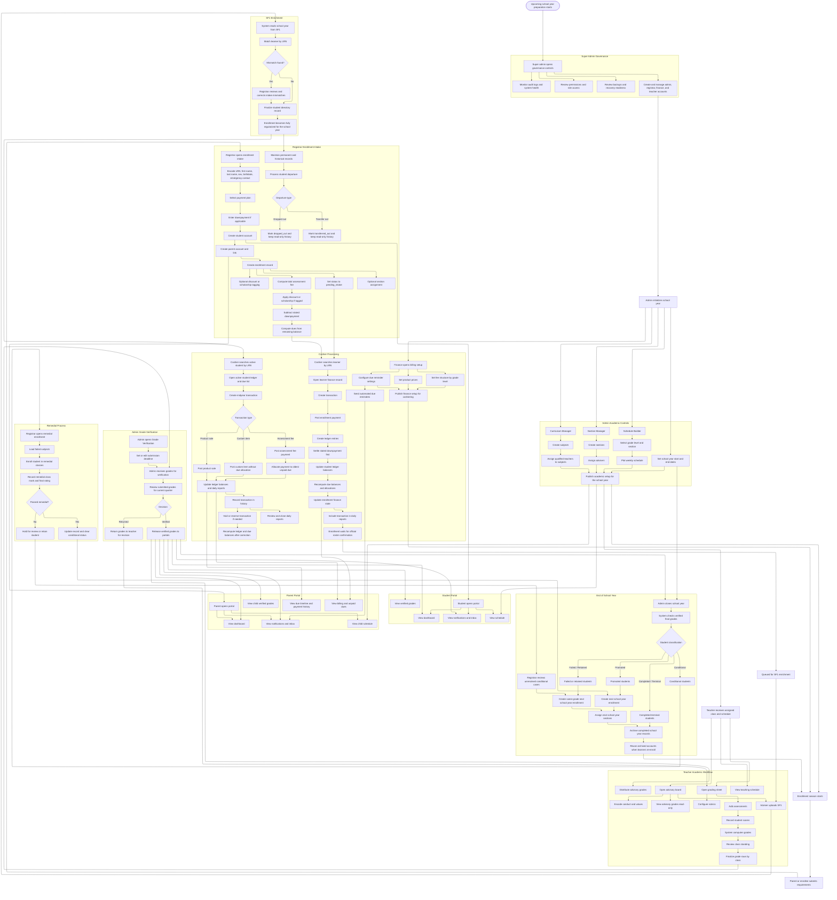

# Super Admin, Admin, Enrollment, Teacher, Student, Parent, and Year-End Flowchart

This file shows the super admin governance flow, the admin academic-controls setup, the enrollment workflow, the teacher workflow, the student and parent portal workflows, and the year-end progression flow in one Mermaid chart.

Use a Markdown preview that supports Mermaid, or open it in Mermaid Live Editor.

