# MarriottConnect Core Design Diagrams

This file contains the source diagrams for the **Design of Software, System, Product, and/or Processes** section. The diagrams are written in Graphviz DOT. This replaced the earlier Mermaid/D2 versions because DOT gives cleaner document-style layouts and sharp orthogonal connectors.

The rendered files are stored in `capstone-paper/figure-sources/exported-diagrams/svg/` and `capstone-paper/figure-sources/exported-diagrams/png/`.

## Figure X. Context Flow Diagram of MarriottConnect

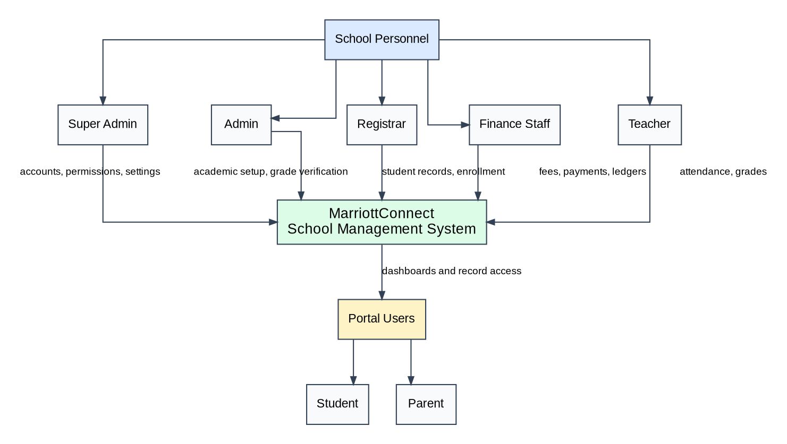

## Figure X. Data Flow Diagram of MarriottConnect

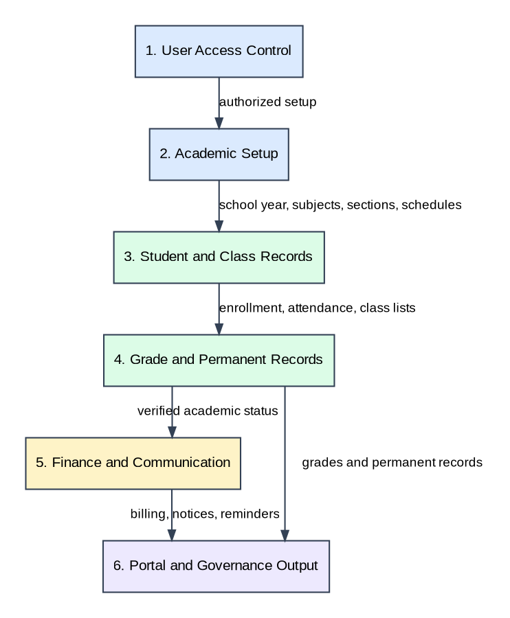

## Figure X. Entity Relationship Diagram of MarriottConnect - Academic and Learner Records

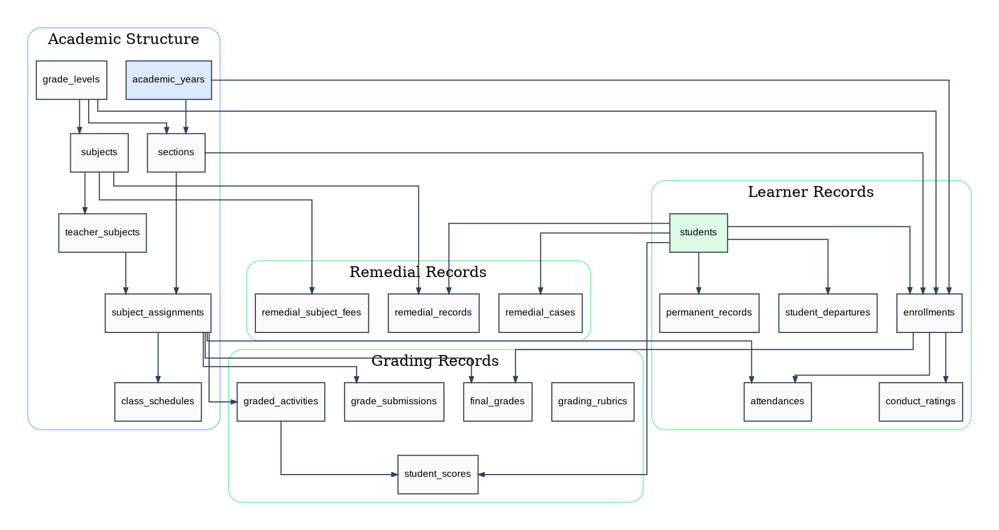

## Figure X. Entity Relationship Diagram of MarriottConnect - Finance Records

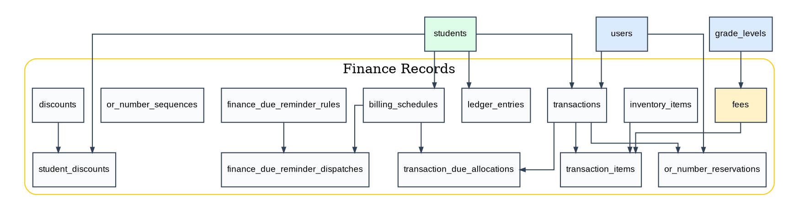

## Figure X. Entity Relationship Diagram of MarriottConnect - Access and Communication Records

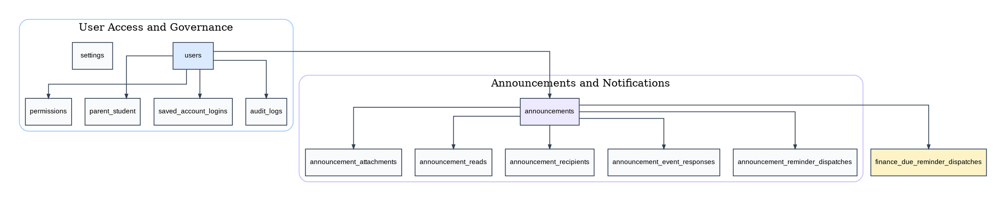

## Figure X. HIPO Chart of Super Admin Account

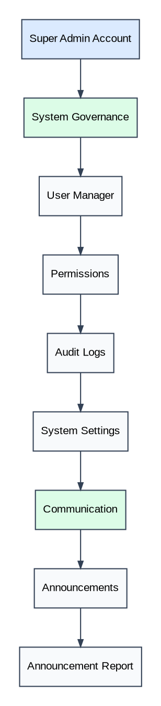

## Figure X. HIPO Chart of Admin Account

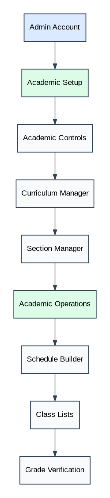

## Figure X. HIPO Chart of Registrar Account

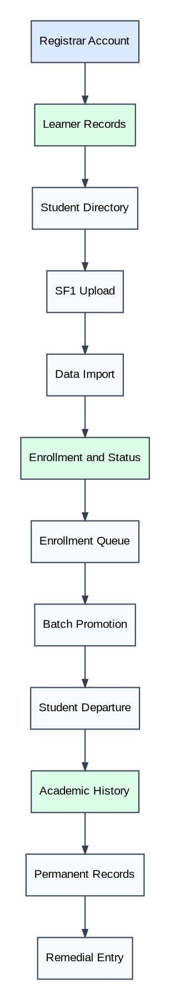

## Figure X. HIPO Chart of Finance Account

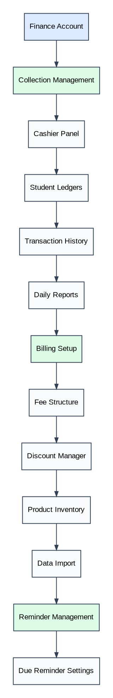

## Figure X. HIPO Chart of Teacher Account

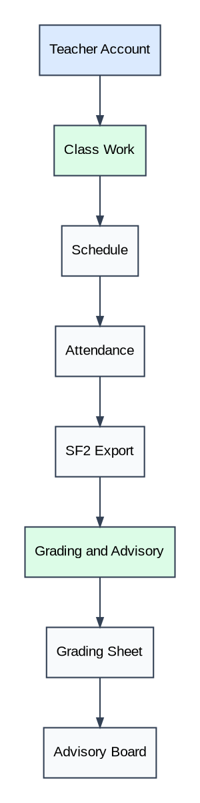

## Figure X. HIPO Chart of Student Account

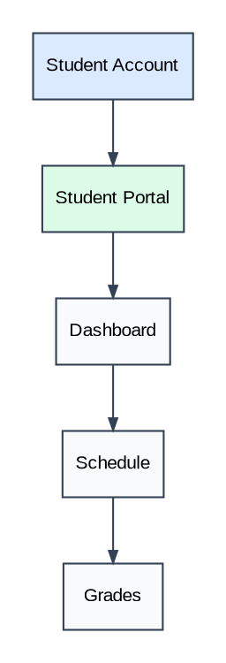

## Figure X. HIPO Chart of Parent Account

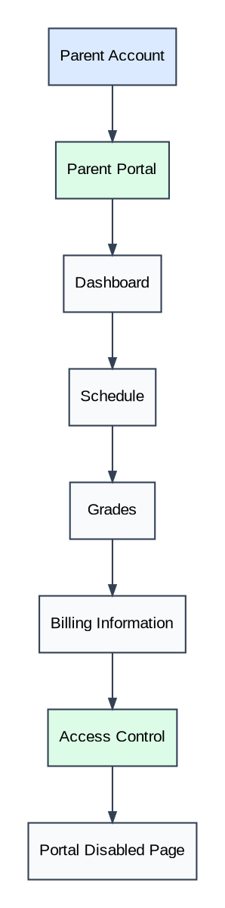
